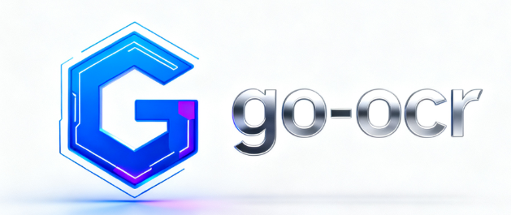

<h1 align="center">
    
</h1>

<p align="center">
   <a href="https://github.com/getcharzp/go-ocr/fork" target="blank">
      
   </a>
   <a href="https://github.com/getcharzp/go-ocr/stargazers" target="blank">
      
   </a>
   <a href="https://github.com/getcharzp/go-ocr/pulls" target="blank">
      
   </a>
   <a href='https://github.com/getcharzp/go-ocr/releases'>
      
   </a>
</p>

go-ocr 是一款基于 Golang + ONNX 构建的 OCR 工具库，专注于为 Go 生态提供简单易用、可扩展的文字识别能力。
目前已完成与 PaddleOCR 的对接，支持快速实现图像文字检测与识别。

## 安装

```shell
# 下载包
go get -u github.com/getcharzp/go-ocr

# 下载模型 + 动态链接库
git clone https://huggingface.co/getcharzp/go-ocr
```

## 快速开始

例如 `Md5()` 方法，使用方式如下所示，其它方法参考功能列表及其测试案例。

```go
package main

import (
	ocr "github.com/getcharzp/go-ocr"
	"github.com/up-zero/gotool/imageutil"
	"log"
)

func main() {
	// 按实际情况配置下述路径
	config := ocr.Config{
		OnnxRuntimeLibPath: "./lib/onnxruntime_amd64.so",
		DetModelPath:       "./paddle_weights/det.onnx",
		RecModelPath:       "./paddle_weights/rec.onnx",
		DictPath:           "./paddle_weights/dict.txt",
	}

	// 初始化引擎
	var engine ocr.Engine
	engine, err := ocr.NewPaddleOcrEngine(config)
	if err != nil {
		log.Fatalf("创建 OCR 引擎失败: %v\n", err)
	}
	defer engine.Destroy()

	// 打开图像
	imagePath := "./test.jpg"
	img, err := imageutil.Open(imagePath)
	if err != nil {
		log.Fatalf("加载图像失败: %v\n", err)
	}

	// OCR识别
	results, err := engine.RunOCR(img)
	if err != nil {
		log.Fatalf("运行 OCR 失败: %v\n", err)
	}
	for _, result := range results {
		log.Printf("识别结果: %v\n", result)
	}
}
```