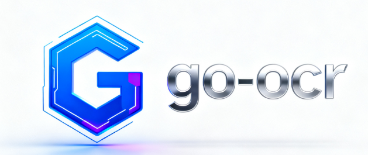
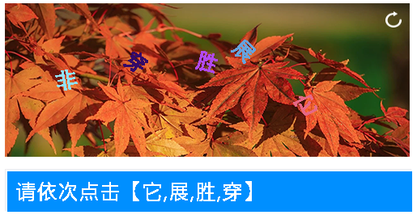

<div align="center" style="text-align: center;">
  
</div>

<p align="center">
   <a href="https://github.com/getcharzp/go-ocr/fork" target="blank">
      
   </a>
   <a href="https://github.com/getcharzp/go-ocr/stargazers" target="blank">
      
   </a>
   <a href="https://github.com/getcharzp/go-ocr/pulls" target="blank">
      
   </a>
</p>

go-ocr 是一款基于 Golang + ONNX 构建的 OCR 工具库，专注于为 Go 生态提供简单易用、可扩展的文字识别能力。
目前已完成与 PaddleOCR、DdddOCR 的对接，支持快速实现图像文字检测与识别。

## 安装

### 1. 安装 Go 依赖

```shell
go get -u github.com/getcharzp/go-ocr
```

### 2. 按需下载模型与动态链接库

模型与动态链接库存放在独立仓库（HuggingFace，含 ModelScope 国内镜像），**无需全量下载**，请根据实际使用的引擎按需下载所需文件。

- HuggingFace 仓库地址：https://huggingface.co/getcharzp/go-ocr
- ModelScope 镜像地址：https://www.modelscope.cn/getcharzp/go-ocr

**目录结构**

```txt
paddle_weights/            # PaddleOCR 所需
ddddocr_weights/           # DdddOCR 所需
lib/                       # onnxruntime 动态链接库（按平台选择）
```

**动态链接库选择**

onnxruntime 动态链接库需按运行平台选择：

| 平台 | 文件 |
| --- | --- |
| Linux | `lib/onnxruntime_amd64.so` |
| Windows | `lib/onnxruntime.dll` |
| macOS | `lib/onnxruntime_amd64.dylib` |

## 快速开始

### PaddleOCR

**示例代码**

通过 OCR 引擎的 `RunOCR()` 方法能直接进行完整的检测与识别，也可以通过 `RunDetect()` 仅进行文字区域检测。

```go
package main

import (
	ocr "github.com/getcharzp/go-ocr"
	"github.com/getcharzp/go-ocr/paddle"
	"github.com/up-zero/gotool/imageutil"
	"log"
)

func main() {
	// 按实际情况配置下述路径
	config := paddle.Config{
		OnnxRuntimeLibPath: "./lib/onnxruntime_amd64.so",
		DetModelPath:       "./paddle_weights/det.onnx",
		RecModelPath:       "./paddle_weights/rec.onnx",
		DictPath:           "./paddle_weights/dict.txt",
		// ThreadCount: 4, // (可选) 并行识别 Session 数, 默认 1
	}

	// 初始化引擎（返回对象实现了 ocr.Engine 接口）
	var engine ocr.Engine
	engine, err := paddle.NewEngine(config)
	if err != nil {
		log.Fatalf("创建 OCR 引擎失败: %v\n", err)
	}
	defer engine.Destroy()

	// 打开图像
	imagePath := "./test.jpg"
	img, err := imageutil.Open(imagePath)
	if err != nil {
		log.Fatalf("加载图像失败: %v\n", err)
	}

	// OCR识别
	results, err := engine.RunOCR(img)
	if err != nil {
		log.Fatalf("运行 OCR 失败: %v\n", err)
	}
	for _, result := range results {
		log.Printf("识别结果: %v\n", result)
	}
}
```

**示例效果**

| 原图                                                  | 检测结果                                               |
|-----------------------------------------------------|----------------------------------------------------|
|  |  |


### DdddOCR

**示例代码**

```go
package main

import (
	"github.com/getcharzp/go-ocr/ddddocr"
	"github.com/up-zero/gotool/imageutil"
	"image"
	"image/color"
	"image/draw"
	"log"
)

func main() {
	config := ddddocr.Config{
		OnnxRuntimeLibPath: "../lib/onnxruntime.dll",
		DetModelPath:       "../ddddocr_weights/common_det.onnx",
	}

	engine, err := ddddocr.NewEngine(config)
	if err != nil {
		log.Fatalf("创建 OCR 引擎失败: %v\n", err)
	}
	defer engine.Destroy()

	imagePath := "./captcha_det.png"
	img, err := imageutil.Open(imagePath)
	if err != nil {
		log.Fatalf("加载图像失败: %v\n", err)
	}

	boxes, err := engine.Detect(img)
	if err != nil {
		log.Fatalf("运行检测失败: %v\n", err)
	}

	tagImg := image.NewRGBA(img.Bounds())
	draw.Draw(tagImg, img.Bounds(), img, image.Point{}, draw.Src)

	for _, box := range boxes {
		imageutil.DrawThickRectOutline(tagImg, image.Rectangle{Min: image.Point{X: box.Box[0], Y: box.Box[1]},
			Max: image.Point{X: box.Box[2], Y: box.Box[3]}}, color.Black, 2)
	}
	imageutil.Save("captcha_det_result.png", tagImg, 100)
}
```

**示例效果**

| 原图                                                          | 检测结果                                                              |
|-------------------------------------------------------------|-------------------------------------------------------------------|
|   |  |

